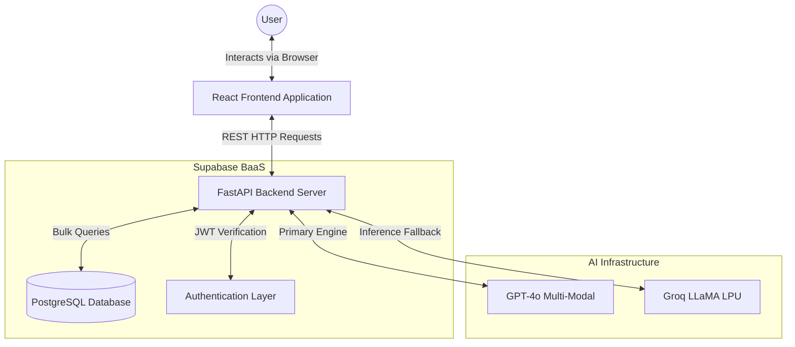

<div align="center">

# <span style="color: #FFB300;">Prashna-AI 🚀</span>

### <span style="color: #FFB300;">*Adaptive AI Quiz Engine & Cognitive Mastery Platform*</span>

---

**An End-to-End AI Ecosystem for Automated Content Synthesis and Cognitive Retention.**

### 🌐 [Live Demo → https://prashna-ai-j73q.onrender.com](https://prashna-ai-j73q.onrender.com)

</div>

---

### 📑 Table of Contents

* [🧠 Overview](#-overview)
* [🎓 What Makes Prashna-AI Different?](#-what-makes-prashna-ai-different)
* [🏛️ Core Philosophy](#-core-philosophy)
* [✨ Key Features](#-key-features)
* [🚀 Core Capabilities](#-core-capabilities)
* [👥 Target Audience](#-target-audience)
* [💻 Technology Stack](#-technology-stack)
* [🏗️ System Architecture](#-system-architecture)
* [🗺️ User Journey & Experience Map](#-user-journey--experience-map)
* [🖥️ Screen-by-Screen Breakdown](#-screen-by-screen-breakdown)
* [🏗️ Layout Component Architecture](#-layout-component-architecture)
* [📊 Result Screen Breakdown](#-result-screen-breakdown)
* [💻 Developer's Portal](#-developers-portal)
* [🔮 Future Roadmap: The Path to v2.0](#-future-roadmap-the-path-to-v20)
* [🤝 Contributing](#-contributing)
* [👥 Meet the Team](#-meet-the-team)
* [📜 License](#-license)

---

### 🧠 Overview

**Prashna-AI** is an intelligent, AI-driven learning ecosystem designed to transform static educational content into dynamic, interactive assessments. It bridges the gap between passive reading and active recall by utilizing a multi-provider AI network (**OpenAI GPT-4o** and **Groq LLaMA-based hardware**) to generate highly accurate, format-perfect quizzes directly from text, PDFs, or live URLs.

---

### 🎓 What Makes Prashna-AI Different?

| Feature | Traditional Platforms | 🚀 Prashna-AI |
| --- | --- | --- |
| **Content** | Pre-defined static question banks | Generated on-the-fly from *your specific* text/PDF/URL |
| **Question Types** | Rigid single formats | Mixed formatting (MCQ, True/False, Fill-in-the-blank, Short Answer) |
| **Testing UI** | Linear flashcards | **Adaptive Exam Mode** (Difficulty scales to your real-time Elo rating) |
| **Deployment** | Heavy local installations | **Monolithic Web App** (React + FastAPI deployed seamlessly on Render) |

---

<div align="center">

## 🏛️ Core Philosophy

# <span style="color: #FFB300;">Synthesize. Retain. Master.</span>

*Eliminating the friction between information and intelligence.*

---

</div>

Prashna-AI operates on three fundamental principles:

1. **🧠 Contextual Intelligence:** Questions are grounded strictly in the provided text, using NLP to define reading complexity (`textstat`) and core semantic themes (`spaCy`, `BERTopic`).
2. **🛡️ Crowdsourced Quality:** Built-in "Flag Question" functionality ensures users can act as community moderators to weed out AI hallucinations.
3. **🎯 Active Recall & Adaptation:** Moving beyond passive reading by automatically matching the question difficulty to the user's historical performance (using a chess-style Elo rating).

---

### ✨ Key Features

| 🛠️ Feature | 📝 Description |
| --- | --- |
| **📄 Document-to-Quiz** | NLP extraction engine that pulls text from uploaded files/URLs, analyzing complexity and auto-summarizing. |
| **⚡ Multi-AI Fallback** | Re-routes API requests (OpenAI -> Groq -> Local Ollama) to ensure 100% uptime for quiz generation. |
| **🧠 Adaptive Elo Engine** | Calculates and assigns a skill rating based on past performance, and dynamically scales the quiz difficulty accordingly. |
| **🧭 Admin Moderation** | Role-Based Access Control (RBAC) securely locked to developer emails for monitoring global use and checking flagged questions. |
| **📊 Advanced Analytics** | Machine-learning-driven Dashboard showing "Weak Areas", performance predictions, and a scalable Knowledge Graph mapping concept relationships. |
| **🎨 Native Cinematic Theming** | Flawless integration of 100% custom-written CSS (no icon/style libraries) with soft natural animations and a dedicated Dark/Light toggle. |

---

## 🚀 Core Capabilities

| Capability | Technical Realization | Impact |
| --- | --- | --- |
| **Contextual NLP Parsing** | `spaCy` & `BERTopic` Pipeline | Extracts core concepts and builds topic clusters from unstructured files. |
| **Format Enforcement** | Groq / GPT JSON-Mode | Restricts the AI to output exactly structured arrays, ending parsing crashes. |
| **Lenient Grading** | Fuzzy String Matching | Grades "Short Answer" text boxes by context/keywords, rather than punishing students for simple typos. |
| **Instant Real-Time DB** | Supabase Bulk Querying | Processes millions of quiz attempts with sub-second dashboard load times by eliminating N+1 query loops. |

---

## 👥 Target Audience

| User Group | Use Case | Primary Benefit |
| --- | --- | --- |
| **🎓 Students** | Exam Preparation | Rapid revision via active recall quizzes built from their own lecture notes. |
| **👨‍🏫 Educators** | Material Generation | Reduces manual question-setting time by over 90% and highlights weak areas perfectly. |
| **💼 Professionals** | Skill Assessment | Accurate, contextual testing derived instantly from corporate training manuals. |

---

## 💻 Technology Stack

| Layer | Technology | Purpose |
| --- | --- | --- |
| **Frontend UI** | React + Vite (Vanilla CSS) | Building a lightning-fast, cinematic, responsive User Interface. |
| **Backend API** | FastAPI (Python) | High-concurrency threaded backend handling heavy ML and AI tasks. |
| **Database & Auth** | Supabase | Secure Postgres-based BaaS handling seamless JWT authentication. |
| **AI Engine** | OpenAI + Groq + Ollama | Ultra-fast inference for generating tailored distractors and tracking text structure. |

---

## 🏗️ System Architecture

Prashna-AI utilizes a streamlined, monolithic container architecture optimized for high-speed AI inference and seamless React routing locally and on the Cloud.

### 📐 High-Level Architecture



---

## 🗺️ User Journey & Experience Map

Prashna-AI is engineered to provide a frictionless path from raw information to conceptual mastery.

| Stage | User Goal | System Touchpoint | Emotional State |
| --- | --- | --- | --- |
| **1. Ingestion** | Upload study material | Content Upload (URL/PDF/Text) | 📤 Hopeful |
| **2. Configuration** | Tailor the assessment | Quiz Generator & Topic Focus | ⚙️ In Control |
| **3. Processing** | Wait for AI results | Loading State (Background Task) | ⏳ Anticipating |
| **4. Testing** | Answer questions adaptively | Active Quiz Arena | 🧠 Focused |
| **5. Validation** | Submit and review | Results & Analytics (Elo Change) | 🎯 Confident |

---

## 🖥️ Screen-by-Screen Breakdown

Our interface is built entirely with custom typography, organic spacing, and CSS-driven component architecture.

| Screen Name | Core Functionality | Key UI Elements |
| --- | --- | --- |
| **🏠 Unified Dashboard** | Central progress hub | Elo Tracker Badge, ML-Predicted Accuracy Charts, Weak Area Alerts. |
| **📝 Upload & Generate** | Material Ingestion | Complexity Speedometer, Topic Tag Pills, Adaptive Mode Toggle Switch. |
| **🛡️ Secure Admin Panel** | Platform Moderation | JWT-Verified access, Flagged-Questions feed with 1-click Delete controls. |

---

## 🏗️ Layout Component Architecture

| Component | UI Role | Functionality & Logic |
| --- | --- | --- |
| **Sidebar Rail** | Navigation | Sticky, context-aware sidebar. Hides 'Admin' unless email matches explicitly. |
| **Content Viewport** | Focus Area | Minimalist container featuring staggered CSS-animation entry points. |
| **React Context Layer** | State Memory Management | Re-renders elements instantaneously (like the Elo badge) when quizzes are submitted. |

---

## 📊 Result Screen Breakdown

The Result Screen transforms raw quiz submission data into a comprehensive learning post-mortem.

| Component | Technical Implementation | Purpose & User Impact |
| --- | --- | --- |
| **🏆 Accuracy Metric** | React Conditional Elements | Provides an immediate high-level overview of the final score vs. expected score. |
| **⚡ Elo Update** | Background Task Sync | Shows exactly how many rating points were won/lost based on dynamic difficulty modifiers. |
| **📝 Option Review** | Semantic Distractor Review | Fully breaks down right/wrong answers visually to highlight the user's specific mistakes. |
| **🚨 Flag Question** | Community Feedback | Button to alert Admins if the AI generated an unfair or confusing question. |

---

## 💻 Developer's Portal

This section provides the technical roadmap for setting up a local development environment for Prashna-AI.

### 📋 Prerequisites

* **Python 3.10+**: For the core FastAPI application.
* **Node.js (NPM)**: For building the React user interface.
* **API Keys Required**: 
  - OpenAI Key
  - Supabase Project URL & Anon Key
  - *Optional:* Groq API Key

### 🛠️ Installation & Setup (Local)

1. **Clone the Project**
```bash
git clone https://github.com/rad-mak/PRASHNA-AI.git
cd PRASHNA-AI
```

2. **Environment Configuration**
Make a `.env` file in the root based on `.env.example`:
```env
OPENAI_API_KEY="..."
SUPABASE_URL="..."
SUPABASE_KEY="..."
JWT_SECRET="..."
```

3. **Backend & Frontend Dependencies**
```bash
# Backend
python -m venv venv
source venv/bin/activate  # Windows: venv\Scripts\activate
pip install -r requirements.txt

# Frontend
cd frontend
npm install
npm run build
cd ..
```

4. **🚀 Launching the Full Stack**
```bash
# Our system serves both React and the API from a single thread pool!
uvicorn backend.main:app --reload --port 8000
```
Open your browser to `http://localhost:8000`

---

## 🔮 Future Roadmap: The Path to v2.0

* [ ] **Local LLM Exclusivity:** Fully enabling lightweight desktop execution for 100% offline study sessions without cloud APIs.
* [ ] **Gamified Multiplayer Arena:** Connect and challenge classmates to real-time Elo-ranked matches on identical syllabuses.
* [ ] **PDF Output Export:** Formatted static generation for teachers who need physical printouts in class.

---

## 🤝 Contributing

Contributions are what make the open-source community such an amazing place to learn, inspire, and create. Any contributions you make are **greatly appreciated**.

1. Fork the Project
2. Create your Feature Branch (`git checkout -b feature/AmazingFeature`)
3. Commit your Changes (`git commit -m 'Add some AmazingFeature'`)
4. Push to the Branch (`git push origin feature/AmazingFeature`)
5. Open a Pull Request

---

## 👥 Meet the Team

Prashna-AI was architected and developed by **Radha Makwana**.

---

## 📜 License

Distributed under the MIT License. See `LICENSE` for more information.
